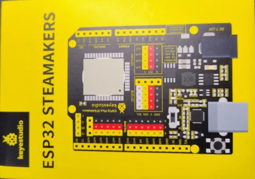

En esta web vamos a encontrar contenidos que resultarán útiles para iniciarnos en la placa ESP32 STEAMakers desarrollada por el equipo de [INNOVA DIDACTIC](https://shop.innovadidactic.com/). La placa tiene formato UNO para que se pueden aprovechar las shields disponibles en ese formato.

   
